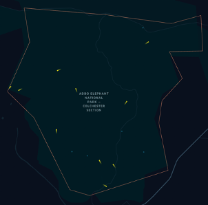

# MARS GeoRasterBlueprint

The MARS GeoRasterBlueprint contains some basic building blocks for designing MARS models that incorporate georeferenced raster data. In the example model, the area of the Addo Elephant National Park is the area of the simulation. The `Elephant` agents can move within the "perimeter", which is defined by the .asc grid file `addo.asc`.

The model also includes waterholes in the form of vector data, which the `Elephant` agents can navigate to. Therefore, the model also illustrates the use of georeferenced vector data.

**Note:** this model intends to showcase some technical aspects of MARS only. It has no aspiration to model elephant behavior accurately.

## How to get raster data

To create a georeferenced raster layer of your simulation area, please see the [MARS documentation](https://mars.haw-hamburg.de/articles/core/tutorials/create_vector_layer_raster_layer.html).

Simple Vector layers can be created with QGIS as well or at [geojson.io](https://geojson.io/).

## Visualizing the model output

The vector data and the movement of the `Elephant` agents can be visualized in [kepler.gl](https://kepler.gl). Below is a screenshot of the visualization output.

  

